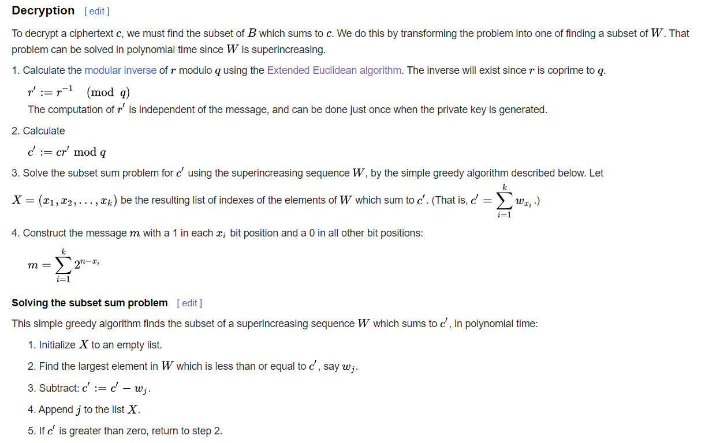
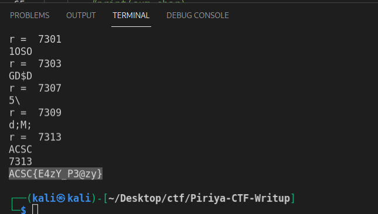
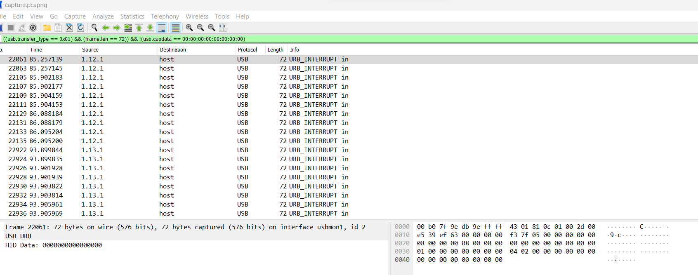
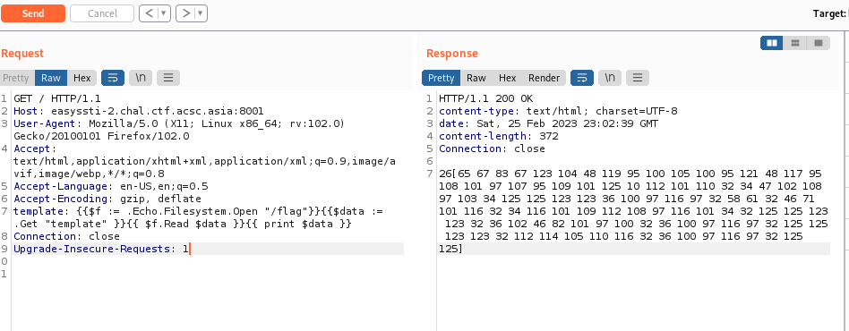
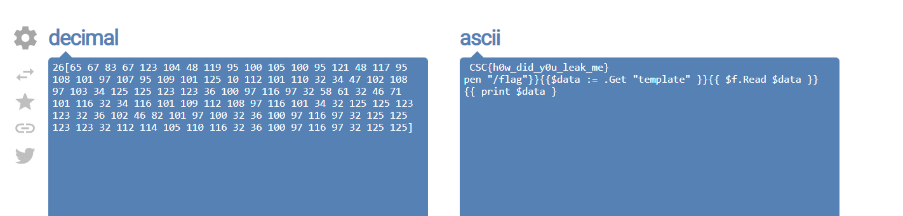

# ACSC Qualification Round 2023
## Table of Content
- [Merkle Hellman](#Merkle-Hellman-(Crypto))
- [pcap-1](#pcap-1-(Forensic))
- [serverless](#serverless-(Rev))
- [easySSTI](#easySSTI-(Web))


## Merkle Hellman (Crypto)

I solved this challenge by implementing the decryption algorithm from Wikipedia.



However, because this challenge did not provide me with the r parameter. So, I attempted to brute-force it using this python code.

[merkle.py](./file/merkle.py)

After running it, I got the flag in a few minutes.



## pcap-1 (Forensic)

First, I attempted to use the Wireshark filter to list all of the USB protocols with keystrokes. 
```
((usb.transfer_type == 0x01) && (frame.len == 72)) && !(usb.capdata == 00:00:00:00:00:00:00:00)
```
Next, I exported them into a JSON file



Then, I used the Python code below to extract keystrokes

[keystroke.py](./file/keystroke.py)

And using this Python code to decode all keystroke payloads

[decode_keystroke.py](./file/decode_keystroke.py)

> ref: https://blog.stayontarget.org/2019/03/decoding-mixed-case-usb-keystrokes-from.html


After decoding, I received a flag with so much junk on it.

```
aaaaAACCSSCC{{aaaaff00rr33nnss11ccssbbbbaabbaaaaaaaaaaaaaaaaaaaaaaaa__bbaaaaiissccddaabb__aaaaaaaaaaaaaaaabbaaaaaaaaaaaass00aaaaaa__bbaaaaaaaaaaaaaaaabbaaaaaaaaaaaaaaffuummdeldelnnaaaaaaaaaaaaaaaaaaaaddddaabbbbccacacddbbccbbaaaabbaaaaaaaa}}
```
So I tried to transform it back into the readable flag.
```
ACSC{f0r3ns1c_is_s0_fun}
```

## serverless (Rev)

After some tinkering with the challenge file, I realized that this is RSA encryption with an extra step.

So this is my decoding step.

1. base64 decoded and reversed the cipher text list
2. Xored the cipher text with the password "acscpass"
3. select j,k,s from the list
4. Changed the cipher text list to a long number
5. Used random p,q,e to decrypt RSA until I got the flag

Here's the code I created to automate this process.

[decrypt.py](./file/decrypt.py)

```ACSC{warmup_challenge_so_easy}```


## easySSTI (Web)

The goal of this challenge is to read the flag without printing it in its normal format in response.

So my plan is to find a way to store the content of the file in a variable and print it in another format. 

I started by storing the flag FS in the $f variable. Then I declare the $data variable to store $f data and print it in binary format.

```
template: {{$f := .Echo.Filesystem.Open "/flag"}}{{$data := .Get "template" }}{{ $f.Read $data }}{{ print $data }}
```



Then decode it using dec2ascii


